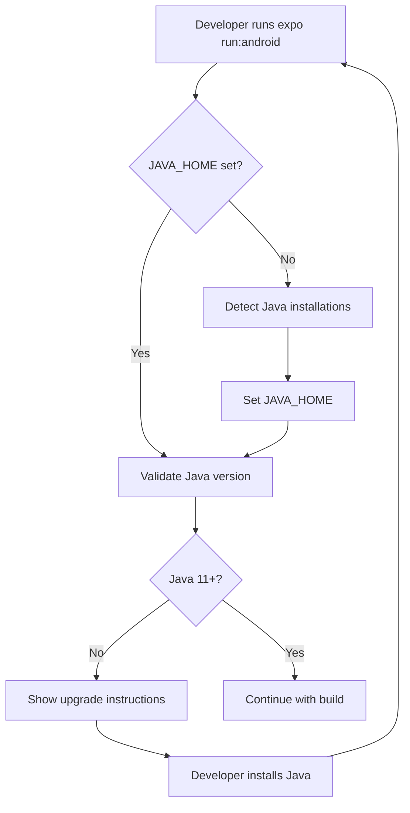
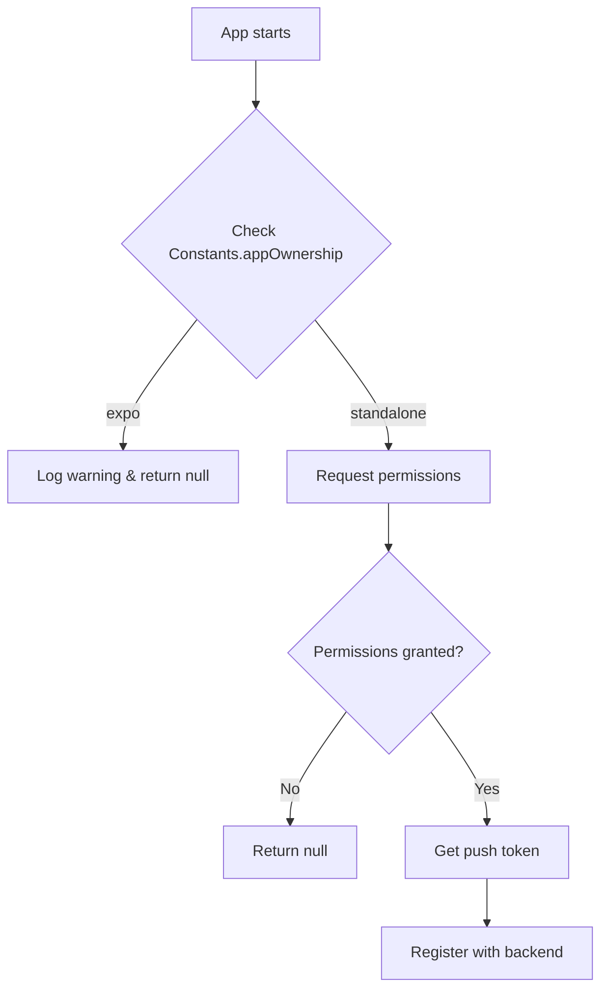

# Expo Go Development Fixes - Technical Design

## Architecture Overview

This design addresses two critical development environment issues:
1. JAVA_HOME configuration for Android development
2. Push notification gating for Expo Go compatibility

## System Components

### 1. Java Environment Detection and Setup

```
Development Environment:
├── Java Detection Script
├── JAVA_HOME Configuration
├── Android SDK Integration
└── Gradle Build System
```

**Design Decisions:**
- **Automatic Detection**: Check multiple common Java installation paths
- **Windows Compatibility**: Handle Program Files paths and spaces
- **Version Validation**: Ensure Java 11+ compatibility
- **Clear Error Messages**: Provide actionable troubleshooting steps

### 2. Push Notification Gating System

```typescript
// Environment-aware push notification service
export class NotificationService {
  static async registerPush(): Promise<string | null> {
    // Gate based on app ownership
    if (Constants.appOwnership === 'expo') {
      console.warn('Push notifications disabled in Expo Go');
      return null;
    }
    
    // Full implementation for production
    return await this.registerProductionPush();
  }
}
```

**Key Components:**
- **Environment Detection**: Use Constants.appOwnership
- **Graceful Degradation**: Return null in development
- **Production Functionality**: Full push notification support
- **Logging**: Clear development warnings

### 3. Configuration Management

```javascript
// app.config.js - Environment-aware configuration
export default {
  expo: {
    extra: {
      eas: { projectId: process.env.EAS_PROJECT_ID }
    },
    plugins: [
      [
        "expo-notifications",
        {
          icon: "./assets/images/notification-icon.png",
          color: "#000000"
        }
      ]
    ],
    android: {
      package: "com.campo.app",
      googleServicesFile: "./android/app/google-services.json"
    }
  }
};
```

## Implementation Details

### Java Environment Setup

**Windows Java Detection Logic:**
```powershell
# Check common Java installation paths
$javaPaths = @(
    "${env:JAVA_HOME}\bin\java.exe",
    "${env:ProgramFiles}\Java\*\bin\java.exe",
    "${env:ProgramFiles(x86)}\Java\*\bin\java.exe",
    "${env:LOCALAPPDATA}\Programs\Java\*\bin\java.exe"
)
```

**JAVA_HOME Configuration:**
1. Detect existing Java installations
2. Set JAVA_HOME environment variable
3. Update PATH to include Java bin directory
4. Validate configuration with `java -version`

### Push Notification Gating

```typescript
// services/NotificationService.ts
import * as Notifications from 'expo-notifications';
import Constants from 'expo-constants';

export async function registerPush(): Promise<string | null> {
  // Gate for Expo Go
  if (Constants.appOwnership === 'expo') {
    console.warn('Push notifications disabled in Expo Go');
    return null;
  }

  try {
    // Request permissions
    const { status } = await Notifications.requestPermissionsAsync();
    if (status !== 'granted') {
      console.warn('Push notification permissions not granted');
      return null;
    }

    // Get push token for production builds
    const token = (await Notifications.getExpoPushTokenAsync()).data;
    console.log('Push token registered:', token);
    return token;
  } catch (error) {
    console.error('Push notification registration failed:', error);
    return null;
  }
}
```

### Configuration Updates

**app.config.js Updates:**
```javascript
export default {
  expo: {
    name: "Campo",
    slug: "campo-app",
    extra: {
      eas: {
        projectId: "your-eas-project-id"
      }
    },
    plugins: [
      [
        "expo-notifications",
        {
          icon: "./assets/images/notification-icon.png",
          color: "#007AFF"
        }
      ]
    ],
    android: {
      package: "com.campo.gestionsales",
      googleServicesFile: "./android/app/google-services.json"
    }
  }
};
```

## Data Flow

### Development Environment Setup Flow



### Push Notification Flow



## Security Considerations

### Environment Variables
- **EAS_PROJECT_ID**: Store in environment variables
- **Google Services**: Secure google-services.json file
- **Push Tokens**: Proper token validation and storage

### Development vs Production
- **Gated Features**: Disable sensitive features in development
- **Logging**: Different log levels for different environments
- **API Keys**: Environment-specific configuration

## Error Handling

### Java Environment Errors
```typescript
interface JavaError {
  type: 'JAVA_HOME_NOT_SET' | 'JAVA_VERSION_INCOMPATIBLE' | 'JAVA_NOT_FOUND';
  message: string;
  solution: string;
}
```

### Push Notification Errors
```typescript
interface PushError {
  type: 'PERMISSIONS_DENIED' | 'TOKEN_GENERATION_FAILED' | 'EXPO_GO_DETECTED';
  message: string;
  fallback: () => void;
}
```

## Testing Strategy

### Java Environment Testing
- Test on clean Windows environments
- Validate multiple Java versions
- Test JAVA_HOME detection logic
- Verify Gradle build success

### Push Notification Testing
- Test in Expo Go (should be gated)
- Test in development build (should work)
- Test in production build (full functionality)
- Test permission scenarios

## Performance Considerations

### Startup Performance
- Lazy load push notification registration
- Cache Java environment detection
- Minimize blocking operations

### Memory Usage
- Efficient environment variable handling
- Proper cleanup of notification listeners
- Optimized configuration loading

## Deployment Considerations

### Development Setup
- Automated Java detection and setup
- Clear setup documentation
- Troubleshooting guides

### Production Builds
- Full push notification functionality
- Proper configuration validation
- Environment-specific optimizations

## Monitoring and Logging

### Development Logging
```typescript
console.warn('Push notifications disabled in Expo Go');
console.log('Java environment detected:', javaVersion);
console.error('JAVA_HOME not set, please configure');
```

### Production Logging
```typescript
console.log('Push token registered successfully');
console.error('Push notification registration failed');
```

## Future Enhancements

### Potential Improvements
1. **Automatic Java Installation**: Script to download and install Java
2. **Environment Switching**: Easy toggle between development/production
3. **Advanced Push Features**: Rich notifications, categories
4. **Configuration Validation**: Automated config checking

### Scalability Considerations
- Support for multiple Java versions
- Cross-platform environment detection
- Plugin-based notification system
- Configurable gating strategies