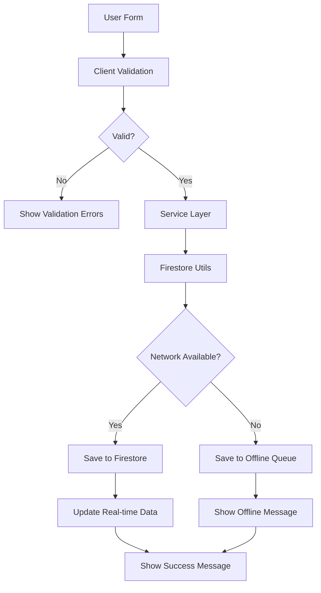

# Design Document

## Overview

Este diseño aborda los problemas identificados en la creación de productos y clientes mediante un enfoque sistemático que incluye mejoras en el manejo de errores, validación de datos, retroalimentación al usuario y sincronización offline. El diseño se enfoca en identificar y corregir los puntos de falla específicos en el flujo actual.

## Architecture

### Current Issues Identified

1. **Type Mismatches**: Inconsistencias entre tipos TypeScript en ClientForm
2. **Error Handling**: Manejo inadecuado de errores en servicios
3. **Validation**: Validación incompleta o incorrecta de datos
4. **Network Issues**: Falta de manejo robusto de problemas de conectividad
5. **User Feedback**: Retroalimentación inconsistente al usuario

### Solution Architecture



## Components and Interfaces

### 1. Form Components Enhancement

**ProductForm.tsx**
- Mejorar manejo de errores de red
- Agregar indicadores de estado más claros
- Implementar retry logic para fallos de red

**ClientForm.tsx**
- Corregir inconsistencias de tipos TypeScript
- Mejorar validación de campos
- Agregar mejor retroalimentación visual

### 2. Service Layer Improvements

**ProductService.ts**
- Agregar manejo robusto de errores
- Implementar retry logic
- Mejorar logging de errores

**ClientService.ts**
- Corregir tipos de datos inconsistentes
- Agregar validación adicional
- Mejorar manejo de errores de Firestore

### 3. Validation Enhancement

**validation.ts**
- Agregar validaciones más específicas
- Mejorar mensajes de error
- Implementar validación en tiempo real

### 4. Error Handling System

```typescript
interface ErrorHandlingStrategy {
  handleNetworkError(error: Error): Promise<void>;
  handleValidationError(errors: string[]): void;
  handleFirestoreError(error: Error): Promise<void>;
  showUserFeedback(type: 'success' | 'error' | 'loading', message: string): void;
}
```

## Data Models

### Enhanced Error Response Model

```typescript
interface ServiceResponse<T> {
  success: boolean;
  data?: T;
  errors?: string[];
  errorType?: 'validation' | 'network' | 'firestore' | 'unknown';
  retryable?: boolean;
}
```

### Form State Model

```typescript
interface FormState {
  isLoading: boolean;
  errors: { [field: string]: string };
  hasUnsavedChanges: boolean;
  isOffline: boolean;
}
```

## Error Handling

### Error Categories

1. **Validation Errors**
   - Client-side validation failures
   - Required field missing
   - Invalid format (phone, email, etc.)

2. **Network Errors**
   - Connection timeout
   - No internet connection
   - Firestore unavailable

3. **Firestore Errors**
   - Permission denied
   - Document not found
   - Quota exceeded

4. **Application Errors**
   - Type mismatches
   - Unexpected exceptions
   - State inconsistencies

### Error Recovery Strategies

```typescript
class ErrorRecoveryManager {
  async handleProductCreationError(error: Error, productData: CreateProductData): Promise<ServiceResponse<string>> {
    if (this.isNetworkError(error)) {
      return this.queueForOfflineSync('product', productData);
    }
    
    if (this.isValidationError(error)) {
      return this.formatValidationResponse(error);
    }
    
    if (this.isRetryableError(error)) {
      return this.retryWithBackoff(() => this.createProduct(productData));
    }
    
    return this.handleFatalError(error);
  }
}
```

## Testing Strategy

### Unit Tests

1. **Form Validation Tests**
   - Test all validation rules
   - Test error message formatting
   - Test form state management

2. **Service Layer Tests**
   - Test error handling scenarios
   - Test offline functionality
   - Test retry logic

3. **Integration Tests**
   - Test complete form submission flow
   - Test offline-to-online sync
   - Test real-time data updates

### Error Simulation Tests

```typescript
describe('Product Creation Error Handling', () => {
  it('should handle network errors gracefully', async () => {
    // Simulate network failure
    mockFirestore.mockRejectedValue(new Error('Network error'));
    
    const result = await productService.createProduct(empresaId, validProductData);
    
    expect(result.success).toBe(false);
    expect(result.errorType).toBe('network');
    expect(result.retryable).toBe(true);
  });
  
  it('should queue data for offline sync', async () => {
    // Test offline queueing
  });
});
```

### User Experience Tests

1. **Loading States**
   - Verify loading indicators appear
   - Test loading state duration
   - Verify loading states clear properly

2. **Error Messages**
   - Test error message clarity
   - Verify error message positioning
   - Test error message dismissal

3. **Success Feedback**
   - Test success message display
   - Verify data updates in UI
   - Test form reset after success

## Implementation Phases

### Phase 1: Type Safety and Validation
- Fix TypeScript type inconsistencies
- Enhance validation rules
- Improve error message formatting

### Phase 2: Error Handling Enhancement
- Implement robust error handling
- Add retry logic
- Improve user feedback

### Phase 3: Offline Support
- Enhance offline data queueing
- Improve sync mechanisms
- Add offline indicators

### Phase 4: Testing and Monitoring
- Add comprehensive tests
- Implement error logging
- Add performance monitoring